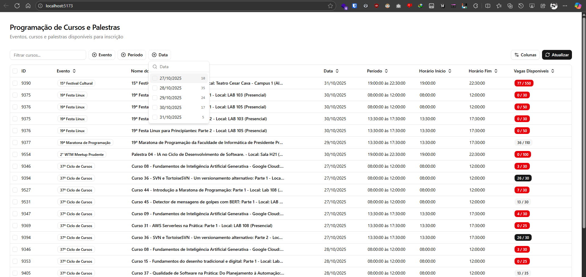

# Infoeste Scraping



Projeto em monorepo (npm workspaces) que disponibiliza uma API REST para scraping de eventos da INFOESTE com Puppeteer e uma interface web moderna para visualização dos dados.

## 🚀 Arquitetura

O projeto foi reestruturado para uma arquitetura **cliente-servidor**:

- **Backend API** (`@infoeste/backend`): Servidor Fastify com Puppeteer persistente, cache inteligente e validação de schema HTML
- **Frontend Web** (`@infoeste/web`): Interface React + Vite + shadcn/ui que consome a API
- **Core** (`@infoeste/core`): Tipos e interfaces compartilhados entre backend e frontend

## 📋 Requisitos

- Node.js v22.18.0 ou superior (recomendado usar a mesma versão via `nvm` ou `fnm`)
- Acesso à internet para que o Puppeteer baixe o Chromium na primeira execução

## 🔧 Instalação

```bash
npm install
```

Esse comando prepara todas as workspaces definidas em `package.json` (`apps/*` e `packages/*`).

## ⚙️ Configuração

### Backend

Crie o arquivo `packages/backend/.env`:

```bash
PORT=3000
CACHE_TTL_SECONDS=300
NODE_ENV=development
```

### Frontend

Crie o arquivo `apps/web/.env`:

```bash
VITE_API_URL=http://localhost:3000
```

## 🎮 Comandos Principais

### Desenvolvimento

```bash
# Iniciar o backend (recomendado executar primeiro)
npm run dev

# Iniciar o frontend (em outro terminal)
npm run dev:web
```

### Produção

```bash
# Build de todos os pacotes
npm run build

# Iniciar backend em produção
npm start --workspace @infoeste/backend
```

### Outros comandos

- `npm run lint`: Verifica o código com Biome
- `npm run fmt:fix`: Formata o código automaticamente
- `npm run clean`: Remove artefatos de build

## 📡 API Endpoints

### `GET /events`

Retorna a lista de eventos com cache inteligente.

**Resposta:**
```json
{
  "success": true,
  "data": [...],
  "cachedAt": "2025-10-16T10:30:00.000Z"
}
```

### `GET /health`

Health check com validação da estrutura HTML da página.

**Resposta (healthy):**
```json
{
  "success": true,
  "status": "healthy",
  "schemaValidation": {
    "isValid": true,
    "errors": []
  },
  "timestamp": "2025-10-16T10:30:00.000Z"
}
```

## 🏗️ Estrutura do Monorepo

```
infoeste-scraping/
├── packages/
│   ├── core/           # Tipos e interfaces compartilhados
│   └── backend/        # API REST com Fastify + Puppeteer
└── apps/
    └── web/            # Frontend React + Vite
```

### Detalhes dos Pacotes

- **`@infoeste/core`**: Entidades (`Event`, `InfoesteEvent`) e contratos (`ICourseRepository`)
- **`@infoeste/backend`**: 
  - Servidor Fastify com CORS
  - Puppeteer persistente (headless, sempre aberto)
  - Cache em memória com TTL configurável
  - Validação estrutural do HTML
  - Rotas `/events` e `/health`
- **`@infoeste/web`**: 
  - Interface React com TanStack Table
  - Componentes shadcn/ui
  - Health check automático
  - Mensagens de erro amigáveis

## 🎯 Funcionalidades Principais

### Backend

✅ **Puppeteer Persistente**: Browser mantido aberto em segundo plano  
✅ **Cache Inteligente**: TTL configurável (padrão: 5 minutos)  
✅ **Health Check**: Valida se a estrutura HTML da página mudou  
✅ **Gestão de Timeout**: Retorna erro se a página não carregar  
✅ **Validação com Zod**: Variáveis de ambiente validadas  
✅ **Graceful Shutdown**: Encerramento limpo do browser  

### Frontend

✅ **Consulta de API**: Busca dados do backend  
✅ **Health Check Automático**: Detecta se o serviço está indisponível  
✅ **Tabelas Interativas**: Filtros, ordenação e paginação  
✅ **UI Moderna**: Componentes shadcn/ui com Tailwind CSS  
✅ **Feedback Visual**: Estados de loading e erro  

## 🐛 Troubleshooting

### Backend

- **Erro de timeout**: Verifique se `https://www.unoeste.br/semanas/2025/37infoeste/CursosPalestras` está acessível
- **Porta ocupada**: Altere `PORT` no `.env`
- **Puppeteer não inicia**: Verifique permissões e se o Chromium foi baixado corretamente

### Frontend

- **CORS error**: Certifique-se que o backend está rodando
- **API não responde**: Verifique `VITE_API_URL` no `.env`
- **"Serviço indisponível"**: O health check detectou mudança na estrutura HTML ou timeout

## 📦 Sistema de Cache

O backend implementa cache em memória com as seguintes características:

- Armazena eventos com timestamp de expiração
- TTL configurável via `CACHE_TTL_SECONDS`
- Invalidação automática após expiração
- Primeira requisição: scraping da página
- Requisições subsequentes: retorno instantâneo do cache

## 🔍 Validação de Schema HTML

O sistema valida automaticamente:

- Presença de `#listaHorarios`
- Estrutura `li > .tituloDoTipo + table > tbody > tr`
- Mínimo de 4 colunas nas tabelas
- Links válidos na primeira coluna
- Quantidade adequada de eventos

Se a estrutura mudar, o frontend exibe mensagem de "serviço indisponível".